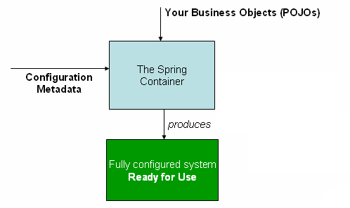

# IoC 컨테이너

## Spring IoC (Inversion Of Control)이란?


IoC(Inversion Of Control) 즉 제어의 역전은 소프트웨어 엔지니어링 원칙으로, \
객체의 생성, 생명 주기 관리까지 이르러 **모든 객체에 대한 제어권이 바뀌었음** 을 의미합니다.


IoC는 제어의 역전을 통해 애플리케이션에서 외부 프레임워크나 컨테이너로 **제어 책임을 전환**합니다.

즉 스프링 애플리케이션에서는 **오브젝트(Bean)의 생성과 의존관계 설정, 사용, 제거 등의 작업**을 애플리케이션 코드(내부자) 대신 **스프링 컨테이너(외부자)가 담당**하게 됩니다.

IoC를 달성하기 위한 방법으로는 **다양한 패턴**들이 존재합니다.

1. Service Locator pattern
2. Factory Pattern
3. Abstract Factory
4. Template Method
5. Strategy design pattern
6. ⭐ Dependency Injection ⭐

### DI(Dependency Injection)

DI(의존성 주입)는 IoC를 구현하는데 사용할 수 있는 **패턴**입니다.

제어가 반전되어 객체의 의존성을 외부로부터 주입 받을 수 있습니다.

> 의존성이란 한 클래스의 변경 시 다른 클래스도 영향을 받을 수 있는 관계를 말합니다.


Spring DI, 즉 Spring에서 의존성을 주입하기 위한 방법으로는 다음과 같이 3**가지가** 있습니다.

1. **생성자 기반** 종속성 주입
2. **세터(Setter)** **기반** 종속성 주입
3. **필드 기반** 종속성 주입

### IoC의 장점

1. 객체 간의 느슨한 결합도
2. 프로그램의 더 큰 모듈성
3. 코드 중복 방지
4. 용이한 유지보수

## IoC 컨테이너


IoC 컨테이너는 객체들의 생명주기가 개발자가 아닌 **프레임워크를 통해 제어되는 IoC방식**을 이용하기 때문에, IoC컨테이너 라는 명칭을 가지게 되었습니다.


### Spring Container 생성 원리


<figure><figcaption><p>The Spring IoC Container</p></figcaption></figure>

다음은 Spring상에서 IoC Container가 만들어지는 원리입니다.

**Configuration Metadata**에서 개발자가 Spring IoC Container에 **애플리케이션의 구성요소를 인스턴스화(Bean), 구성 및 조립하도록 설정하는 방법**을 기재합니다.


Spring IoC컨테이너 자체는 이 Configuration Metadata가 작성되는 형식과 분리되어 있습니다.

> POJO(Plain Old Java Object)란? \
> **객체지향적으로 구현한 자바 객체**를 의미합니다.


### ApplicationContext 란?



**ApplicationContext란?**

Spring Framework내의 **ApplicationContext 인터페이스**는 IoC 컨테이너를 나타냅니다.

기존 Spring에서는 Bean의 생성과 관계 설정 등의 제어를 담당하는 IoC Container인 **Bean Factory** 가 존재하나, 이외의 추가적인 기능 이용의 이유로 Bean Factory를 상속받아 확장한 **Application Context**를 사용하게 됩니다.


<figure><figcaption><p>BeanFactory 를 Extends하여 생성된 Application Context</p></figcaption></figure>


**ApplicationContext 구현체**

**ApplicationContext 구현체로** AnnotationConfigApplicationContext, ClassPathXmlApplicationContext 및 FileSystemXmlApplicationContext, 웹 애플리케이션을 위한 WebApplicationContext등 이 존재합니다.

보통 AnnotationConfigApplicationContext, ClassPathXmlApplicationContext 인스턴스를 생성하여 **ApplicationContext 인터페이스**를 구현하는 것이 일반적입니다.


IoC 컨테이너는 **Bean**이라는 객체를 인스턴스 화 하고, 구성 및 조립, 라이프 사이클 관리를 하게 됩니다.


**ClassPathXmlApplicationContext를 선언한 방법**

ApplicationContext context = new

ClassPathXmlApplicationContext ("applicationContext.xml");



**AnnotationConfigApplicationContext를 선언한 방법**\
&#x20;AnnotationConfigApplicationContext annotationContext = new AnnotationConfigApplicationContext();


즉 IoC 컨테이너는 **DI(Dependency Injection)** 즉 **종속성 주입**을 이용하여 어플리케이션에서 구성하는 컴포넌트들을 관리합니다.


## Bean이란?


Spring에서 "**Bean**"은 Spring IoC(Inversion of Control) 컨테이너에 의해 인스턴스화 되고 조립되며 관리되는 객체를 말합니다. **Bean**은 Spring 애플리케이션의 핵심 구성 요소이며, 컨테이너는 이러한 **Bean**의 생명 주기와 구성을 책임집니다.


IoC에 의하여 자바 객체가 생성되면 이 객체를 Bean이라고 합니다.

이러한 Bean은 @Bean, @Component, @Service, @Repository등 과 같은 어노테이션으로 등록될 수 있고, application.xml과 같은 XML파일에 Bean을 직접 등록하는 것이 가능합니다.


### Bean과 Singleton

ApplicationContext에 의해 등록된 Bean은 기본적으로 **Singleton**으로 관리됩니다.

#### Spring IoC Container의 Bean생성 순서

다음은 Spring IoC Container에서의 Bean **LifeCycle 순서**입니다.

1. Bean객체 생성
2. 의존 설정&#x20;
3. 초기화 (ex. Connection Pool)
4. 사용
5. 소멸

### Spring Bean Scope

Spring Bean은 생성되고, 존재하고, 적용되는 범위를 Scope를 통해 제어할 수 있습니다.


#### Singleton Scope (Default)

각  Spring IoC Container에 대해 Bean의 Scope를 단일 객체 인스턴스로 지정합니다.

Spring Bean이 Singleton 객체 인 경우 여러 Thread에서 Singleton 객체의 상태를 가져다 쓸 때 해당 Bean의 상태를 항상 예측하는 것이 불가 하기 때문에 상태 값을 가지면 안됩니다.


**Singleton Pattern에 무상태(Stateless)가 필요한 이유?**\


하나의 객체를 공유하는 싱글톤 패턴의 특성 상 여러 개의 Thread가 하나의 객체를 참조하는 경우 제대로 된 상태 값을 참조하지 못하는 경우가 발생할 수 있으므로 Singleton Scope를 갖는 Spring Bean의 경우 무상태(Stateless)로 존재하여야 합니다.



#### Prototype Scope

IoC Container와 함께 Singleton 으로 생성 및 소멸되지 않고 요청 시 마다 객체가 생성이 될 수 있는 Scope입니다.

이외에 다른 **Request Scope, Session Scope, Application Scope, WebSocket Scope** 등이 있습니다.

### Lazy-initialized Beans&#x20;


Lazy-initialization 은 실제 Bean이 처음 요청 시 Bean을 생성하도록 합니다.

다음은 XML에서 \<bean/>의 속성으로 **lazy-init속성**을 사용한 코드입니다.

```xml
<bean id="lazy" class="com.something.ExpensiveToCreateBean" lazy-init="true"/>
<bean name="not.lazy" class="com.something.AnotherBean"/>
```

&#x20;Lazy-Initialization을 이용하게 되면 애플리케이션 시작 시 생성되는 Bean수를 줄일 수 있으므로 **Application의 시작 시간을 개선**할 수 있습니다.

다만 Lazy-Initialization의 경우 요청 시 Bean의 생성이 되므로 애플리케이션 시작 시 식별할 수 있는 문제를 인지 불가능 하다는 단점이 있습니다.


**레퍼런스**

[**https://docs.spring.io/spring-framework/docs/2.5.x/reference/beans.html**](https://docs.spring.io/spring-framework/docs/2.5.x/reference/beans.html)\
[**https://velog.io/@rg970604/spring%EA%B8%B0%EB%B3%B83.-%EC%8A%A4%ED%94%84%EB%A7%81-%EC%BB%A8%ED%85%8C%EC%9D%B4%EB%84%88%EC%99%80-%EC%8A%A4%ED%94%84%EB%A7%81-%EB%B9%88-BeanFactoryApplicationContextBeanDefinition**](https://velog.io/@rg970604/spring%EA%B8%B0%EB%B3%B83.-%EC%8A%A4%ED%94%84%EB%A7%81-%EC%BB%A8%ED%85%8C%EC%9D%B4%EB%84%88%EC%99%80-%EC%8A%A4%ED%94%84%EB%A7%81-%EB%B9%88-BeanFactoryApplicationContextBeanDefinition)
