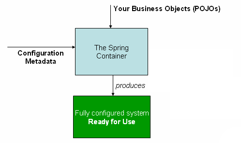

# 🌿 IoC 컨테이너

## Spring IoC (Inversion Of Control)이란?

💡 IoC(Inversion Of Control) 즉 제어의 역전은 소프트웨어 엔지니어링 원칙으로, \
객체의 생성, 생명 주기 관리까지 이르러 **모든 객체에 대한 제어권이 바뀌었음** 을 의미합니다.

IoC는 제어의 역전을 통해 애플리케이션에서 외부 프레임워크나 컨테이너로 **제어 책임을 전환**합니다.

즉 스프링 애플리케이션에서는 **오브젝트(Bean)의 생성과 의존관계 설정, 사용, 제거 등의 작업**을 애플리케이션 코드(내부자) 대신 **스프링 컨테이너(외부자)가 담당**하게 됩니다.

IoC를 달성하기 위한 방법으로는 **다양한 패턴**들이 존재합니다.

1. Service Locator pattern
2. Factory Pattern
3. Abstract Factory
4. Template Method
5. Strategy design pattern
6. ⭐ Dependency Injection ⭐

### DI(Dependency Injection)

DI(의존성 주입)는 IoC를 구현하는데 사용할 수 있는 **패턴**입니다.

제어가 반전되어 객체의 의존성을 외부로부터 주입 받을 수 있습니다.

> 의존성이란 한 클래스의 변경 시 다른 클래스도 영향을 받을 수 있는 관계를 말합니다.

### IoC의 장점

1. 객체 간의 느슨한 결합도
2. 프로그램의 더 큰 모듈성
3. 코드 중복 방지
4. 용이한 유지보수

## IoC 컨테이너

💡 IoC 컨테이너는 객체들의 생명주기가 개발자가 아닌 **프레임워크를 통해 제어되는 IoC방식**을 이용하기 때문에, IoC컨테이너 라는 명칭을 가지게 되었습니다.

### Spring Container 생성 원리

<figure><figcaption>
The Spring IoC Container
</figcaption></figure>

다음은 Spring상에서 IoC Container가 만들어지는 원리입니다.

**Configuration Metadata**에서 개발자가 Spring IoC Container에 **애플리케이션의 구성요소를 인스턴스화(Bean), 구성 및 조립하도록 설정하는 방법**을 기재합니다.

Spring IoC컨테이너 자체는 이 Configuration Metadata가 작성되는 형식과 분리되어 있습니다.

> POJO(Plain Old Java Object)란? \
> **객체지향적으로 구현한 자바 객체**를 의미합니다.

Spring Framework내의 **ApplicationContext 인터페이스**는 IoC 컨테이너를 나타냅니다.

**ApplicationContext 구현체로** AnnotationConfigApplicationContext, ClassPathXmlApplicationContext 및 FileSystemXmlApplicationContext, 웹 애플리케이션을 위한 WebApplicationContext등 이 존재합니다.

보통 AnnotationConfigApplicationContext, ClassPathXmlApplicationContext 인스턴스를 생성하여 **ApplicationContext 인터페이스**를 구현하는 것이 일반적입니다.

IoC 컨테이너는 [Bean](https://www.notion.so/Bean-c05a955264114b5886b829fcaf504393?pvs=21)이라는 객체를 인스턴스 화 하고, 구성 및 조립, 라이프 사이클 관리를 하게 됩니다.

💡 **ClassPathXmlApplicationContext를 선언한 방법**

**ApplicationContext** context = **new**

**ClassPathXmlApplicationContext** ("applicationContext.xml");

💡 **AnnotationConfigApplicationContext를 선언한 방법**\
&#x20;**AnnotationConfigApplicationContext** annotationContext = new **AnnotationConfigApplicationContext**();

즉 IoC 컨테이너는 **DI(Dependency Injection)** 즉 **종속성 주입**을 이용하여 어플리케이션에서 구성하는 컴포넌트들을 관리합니다.
