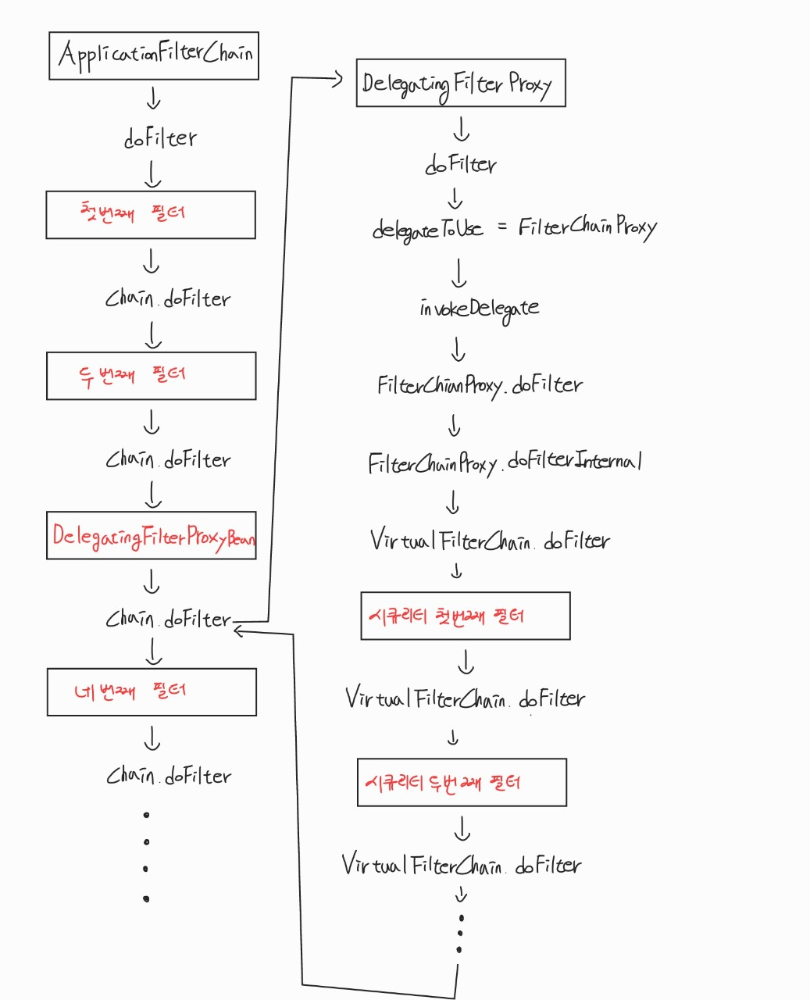
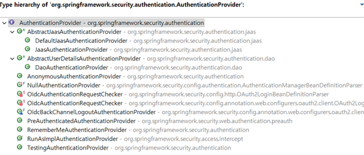

# 🔒 Copy of Security

짧게 서술하면 Spring에서 제공하는 애플리케이션의 <mark style="color:green;">**보안**</mark>을 담당하는 프레임워크입니다.\
Spring 공식 문서에는 Security를 어떻게 설명하는지 한번 알아겠습니다.

> "Spring Security is a framework that provides <mark style="color:green;">**authentication**</mark>, <mark style="color:green;">**authorization**</mark>, and protection against <mark style="color:green;">**common attacks**</mark>."
>
> "Spring Security는 <mark style="color:green;">**인증(Authentication)**</mark>과 <mark style="color:green;">**권한 부여(Authorization)**</mark> 및 <mark style="color:green;">**일반적인 공격**</mark>에 대한 보호를 제공하는 프레임워크이다."

Spring 공식 문서에는 위와같이 설명하고 있습니다.\
그렇다면 여기서 말하는 인증과 권한 부여는 무엇인지 알아 보겠습니다.

* 인증(Authentication)\
  \- 특정 리소스에 접근하려는 사람의 신원을 확인하는 과정\
  \- 일반적인 방법으로 아이디와 비밀번호를 입력하는 방법이 있습니다.
* 권한 부여(Authorization)\
  \- 신원이 인증된 사용자가 특정 리소스에 접근 가능한지 허용하는 과정\
  \- 사용자의 역할에 따라 사용 가능한 기능을 나누기 위한 과정입니다.

이어서 Filter의 과정을 보겠습니다.

<figure><figcaption><p>SecurityFilterChain</p></figcaption></figure>

클라이언트에서 HTTP 요청을 보내면 Servlet 컨테이너가 이 요청을 받습니다.\
그런 뒤 컨테이너 내부의 FilterChain의 Filter들이 순차적으로 실행됩니다.\
중간에 DelegatingFilterProxy가 필터 체인 내에서 FilterChainProxy를 통해 SecurityFilterChain에게 작업을 위임합니다.\


<figure><figcaption><p>SecurityFilterChain 위임 과정</p></figcaption></figure>

위 이미지는 SecurityFilterChain으로 위임되는 과정입니다.\
이어서 스프링 시큐리티 인증 구조를 보겠습니다.\
\


<figure><figcaption><p>스프링 시큐리티 인증 구조</p></figcaption></figure>

1. 클라이언트에서 로그인 정보와 함께 요청(Http Request)을 합니다.
2. AuthenticationFilter를 통해 요청 정보에서 이름과 비밀번호를 추출하여 인증 토큰을 생성합니다.
3. 생성된 토큰을 AuthenticationManager를 통해 ProviderManager로 전달합니다.
4. ProviderManager가 관리하는 인증 제공자(AuthenticationProviders)를 통해 인증을 시도하고 성공 시 인증된 Authentication을 반환합니다.
5. DB에서 사용자 정보를 가져오는 UserDetailsService에 Authentication을 넘겨줍니다.
6. 넘겨받은 정보를 통해 사용자 정보(UserDetails) 객체를 생성합니다.
7. 생성된 사용자 정보를 인증 제공자에게 넘기고 사용자 정보를 비교합니다.
8. 인증 성공 시 Principal(주체), Credentials(자격 증명), Authorities(권한), Authenticated(인증 여부) 등의 정보를 담은 Authentication 객체를 반환합니다.
9. AuthenticationManager는 Authentication 객체를 AuthenticationFilter로 반환합니다.
10. SecurityContextHolder의 SecurityContext에 Authentication 객체를 저장합니다.\


&#x20;위 과정을 실제 코드로는 어떻게 구현되어 있는지 보겠습니다.

**AuthenticationFilter(UsernamePasswordAuthenticationFilter)**\
UsernamePasswordAuthenticationFilter는 username과 password를 추출해서UsernamePasswordAuthenticationToken을 생성합니다.

코드 상으로는 다음과 같습니다.

여기서 UsernamePasswordAuthenticationToken은 다음과 같습니다.

```java
public class UsernamePasswordAuthenticationFilter extends AbstractAuthenticationProcessingFilter {

    @Override
    public Authentication attemptAuthentication(HttpServletRequest request, HttpServletResponse response)
            throws AuthenticationException {
        // POST 요청만 허용
        if (this.postOnly && !request.getMethod().equals("POST")) {
            // 지원되지 않는 인증 방법일 경우 예외 발생
            throw new AuthenticationServiceException("Authentication method not supported: " + request.getMethod());
        }
        
        // 사용자 이름 가져오기
        String username = obtainUsername(request);
        username = (username != null) ? username.trim() : ""; // 사용자 이름이 null이 아닐 경우 공백 제거
        
        // 비밀번호 가져오기
        String password = obtainPassword(request);
        password = (password != null) ? password : ""; // 비밀번호가 null일 경우 빈 문자열로 처리
        
        // 사용자 이름과 비밀번호로 인증 요청 생성 (unauthenticated 상태)
        UsernamePasswordAuthenticationToken authRequest = UsernamePasswordAuthenticationToken.unauthenticated(username, password);
        setDetails(request, authRequest);
        
        // AuthenticationManager에게 인증 요청 전달 및 인증 수행
        return this.getAuthenticationManager().authenticate(authRequest);
    }
}
```

여기서 UsernamePasswordAuthenticationToken은 다음과 같습니다.\
인증 전 토큰을 반환받습니다.

```java
public class UsernamePasswordAuthenticationToken extends AbstractAuthenticationToken {

   private static final long serialVersionUID = SpringSecurityCoreVersion.SERIAL_VERSION_UID;

   private final Object principal;

   private Object credentials;

   // 인증 전
   public UsernamePasswordAuthenticationToken(Object principal, Object credentials) {
      super(null);
      this.principal = principal;
      this.credentials = credentials;
      setAuthenticated(false);
   }
   
   // 인증 후
   public UsernamePasswordAuthenticationToken(Object principal, Object credentials,
         Collection<? extends GrantedAuthority> authorities) {
      super(authorities);
      this.principal = principal;
      this.credentials = credentials;
      super.setAuthenticated(true); 
   }

   public static UsernamePasswordAuthenticationToken unauthenticated(Object principal, Object credentials) {
      return new UsernamePasswordAuthenticationToken(principal, credentials);
   }
}
```

### AuthenticationManager

AuthenticationManager는 ProviderManager로 구현됩니다.

ProviderManager는 여러 AuthenticationProvider를 가지고 있으며

요청된 인증에 따라 적절한 인증을 수행합니다.

인증에 성공하면 인증객체(Authentication)을 반환합니다.

코드 상으로는 다음과 같습니다.

```java
public interface AuthenticationProvider {

   Authentication authenticate(Authentication authentication) throws AuthenticationException;

   boolean supports(Class<?> authentication);

}

public class ProviderManager implements AuthenticationManager, MessageSourceAware, InitializingBean {
   
   // 인증 제공자 리스트
   private List<AuthenticationProvider> providers = Collections.emptyList();

   @Override
   public Authentication authenticate(Authentication authentication) throws AuthenticationException {

      Class<? extends Authentication> toTest = authentication.getClass();
      AuthenticationException lastException = null; 
      AuthenticationException parentException = null; 
      Authentication result = null; // 인증 결과
      Authentication parentResult = null; 
      int currentPosition = 0; 
      int size = this.providers.size(); 

      // 인증 제공자를 순회
      for (AuthenticationProvider provider : getProviders()) {
         
         if (!provider.supports(toTest)) {
            continue;
         }
         if (logger.isTraceEnabled()) {
            =
            logger.trace(LogMessage.format("Authenticating request with %s (%d/%d)",
                  provider.getClass().getSimpleName(), ++currentPosition, size));
         }
         try {
            // 인증 시도
            result = provider.authenticate(authentication);
            if (result != null) {
               // 인증 성공 시 세부 정보 복사
               copyDetails(authentication, result);
               break; // 인증 성공 시 루프 종료
            }
         }
         catch (AccountStatusException | InternalAuthenticationServiceException ex) {
            
            prepareException(ex, authentication);
            throw ex; 
         }
         catch (AuthenticationException ex) {
            
            lastException = ex;
         }
      }
      
      if (result == null && this.parent != null) {
         try {
            
            parentResult = this.parent.authenticate(authentication);
            result = parentResult; 
         }
         catch (ProviderNotFoundException ex) {
            
         }
         catch (AuthenticationException ex) {
            
            parentException = ex;
            lastException = ex; 
         }
      }
      // 인증 성공 시
      if (result != null) {
         
         if (this.eraseCredentialsAfterAuthentication && (result instanceof CredentialsContainer)) {
            ((CredentialsContainer) result).eraseCredentials(); 
         }

         if (parentResult == null) {
            
            this.eventPublisher.publishAuthenticationSuccess(result);
         }

         return result; // 인증 결과 반환
      }

      // 인증 실패 시 예외 처리
      if (lastException == null) {
         
         lastException = new ProviderNotFoundException(this.messages.getMessage("ProviderManager.providerNotFound",
               new Object[] { toTest.getName() }, "No AuthenticationProvider found for {0}"));
      }

      if (parentException == null) {
         
         prepareException(lastException, authentication);
      }
      throw lastException; // 마지막 예외를 던짐
   }
}
```

이후 AuthenticationProvider가 인증 시도를 합니다.


```java
public interface AuthenticationProvider {
	Authentication authenticate(Authentication authentication) throws AuthenticationException;
	boolean supports(Class<?> authentication);
}
```


&#x20;AuthenticationProvider의 구현체는 아래와 같습니다.

<figure><figcaption><p> AuthenticationProvider의 구현체</p></figcaption></figure>

AuthenticationProvider는 UserDetailsService에 인증 객체를 보내고

UserDetailsService는 DB에서 알맞은 사용자를 찾고 UserDetails 객체를 만들어서 반환합니다.

그럼 AuthenticationProvider는 전달받은 UserDetails 객체를 인증하고 인증에 성공하면

인증 여부가 true, 권한이 담긴 인증 객체를 ProviderManager로 반환합니다.

마지막으로 AuthenticationFilter에게 반환하고 로그인 성공여부 핸들러를 통해

SecurityContextHolder에 최종적으로 저장합니다.\
\
\
**참조**\
[**https://docs.spring.io/spring-security/reference/servlet/architecture.html**](https://docs.spring.io/spring-security/reference/servlet/architecture.html)\
[**https://emgc.tistory.com/126**](https://emgc.tistory.com/126)\
