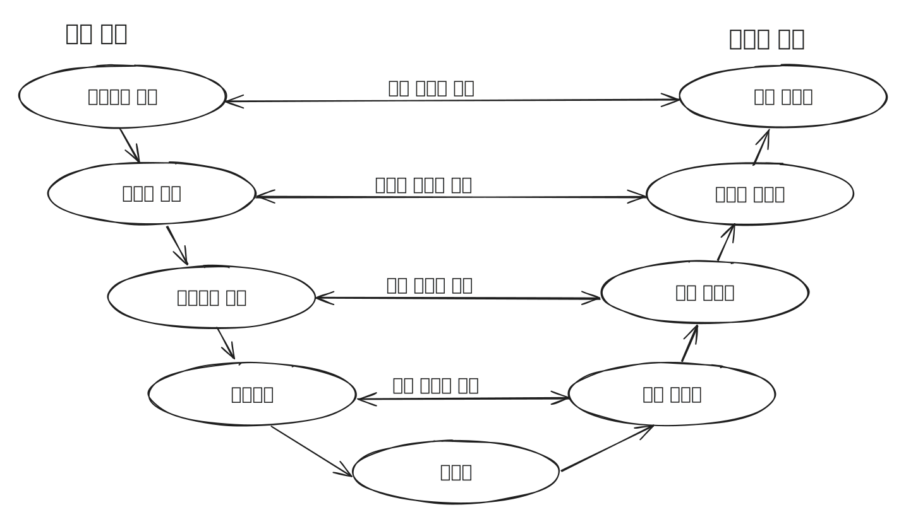

# Testing

## **테스트(Test)란?** 

테스트는 제품(소프트웨어) 또는 서비스가 예상하는 대로 동작하는지 확인하는 작업을 말합니다.테스트

## **테스트 코드(Test Code)란?** 

테스트 코드는 소프트웨어의 기능과 동작을 테스트하기 위한 코드입니다.

## **테스트 코드의 필요성** 

왜 우리는 서비스 개발 시 테스트 코드를 작성하고 테스트를 수행해야 할까요?

* 리펙토링이 편하다.
* 디버깅 시간이 줄여준다.
* 동작하는 문서 역할을 한다.

이외에도 많은 이점이 존재합니다. \
~~코드 품질 보장, 회기 테스트, 배포 안정성, 품질향상, 자동화, 협업 능력 향상 등등~~ \
\
\
아래 V 모델(V-Model)은 **시스템 개발 과정을 시각화 한 모델**로 범위에 따라 테스트를 구분합니다.

우리는 **스프링을  사용**하여 서비스 개발 시 **테스트 코드를 작성**하여 그림처럼 구분화한 각 테스트 단계별\
**테스트를 수행**할 수 있습니다.

## **테스트 주도 개발 (TDD - Test Driven Development)** 

소프트웨어 개발 방법론 중 하나로, 코드를 작성하기 전에 테스트 케이스를 먼저 작성하는 방식입니다.\
우리는테스트 주도 개발을 함으로써 아래와 같은 장점을 얻을 수 있습니다.

* **테스트 커버리지가 높아진다**: 테스트 커버리지는 시스템 또는 소프트웨어의 각 부분이 얼마나 잘 테스트되고 있는지를 나타냅니다. TDD를 통해 테스트 커버리지를 높여 코드의 품질과 신뢰성을 향상시킬 수 있습니다.
* **오버 엔지니어링 방지**: TDD는 필요한 기능만 구현하게 하여 불필요한 코드 작성을 방지하고, 효율적이고 간결한 코드를 작성할 수 있게 합니다.
* **피드백이 빠르다**: TDD는 설계 단계에서 테스트 코드를 작성하고, 이를 기반으로 코드를 수정하고 개발함으로써 빠른 피드백을 제공합니다. 이로 인해 문제를 조기에 발견하고 해결할 수 있습니다.

<figure><figcaption>
TDD의 절차
</figcaption></figure>

테스트 주도 개발은 다음과 같은 순환절차로 진행됩니다

* **Red**: 실패하는 테스트를 작성합니다.
* **Green**: 테스트를 통과하기 위해 필요한 최소한의 코드를 작성합니다.
* **Refactor**: 코드를 리팩토링하여 더 나은 구조로 만듭니다.\

스프링 팀은 **테스트 주도 개발(TDD)을 권장**하며, [스프링 IoC 컨테이너](../core-technologies/ioc-container.md), 적절한 생성자, 및 setter 메서드를 활용하면 테스트를 보다 쉽게 수행할 수 있습니다.
